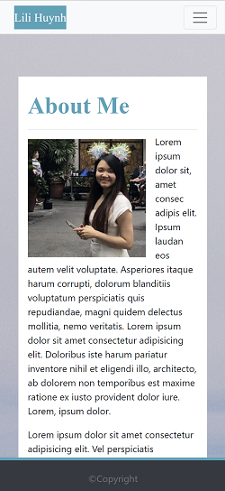
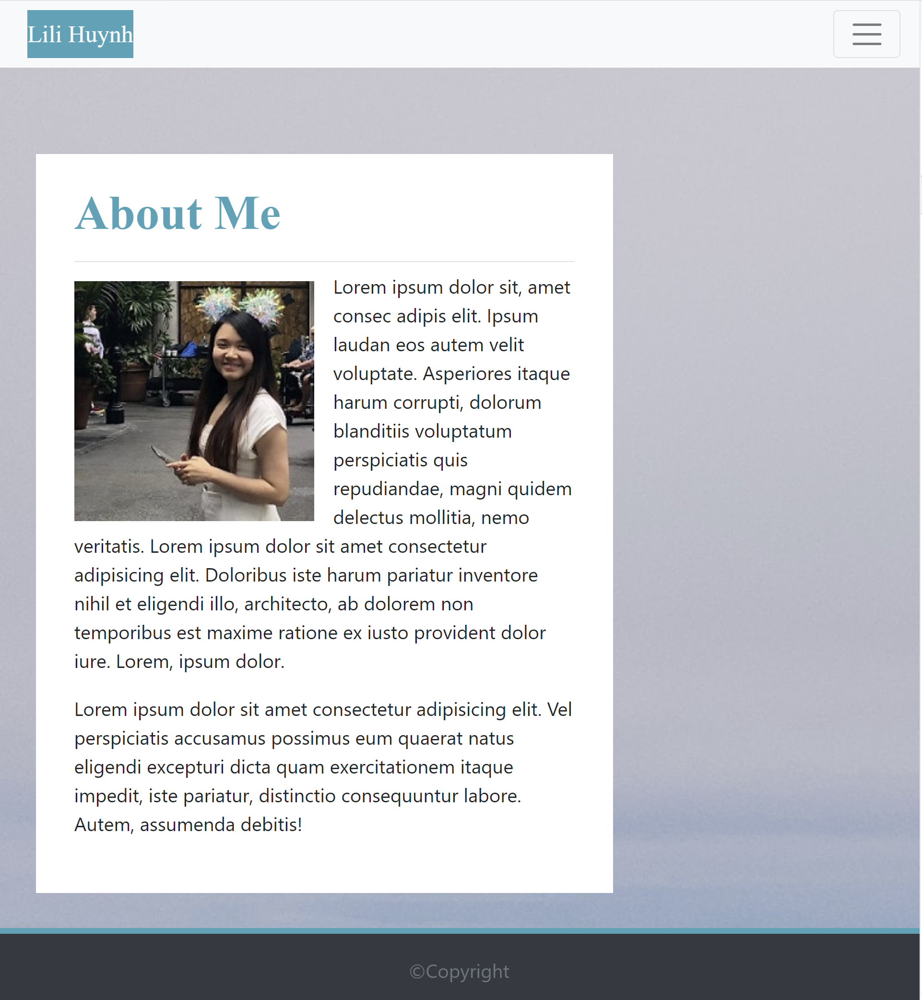
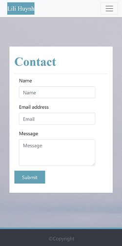
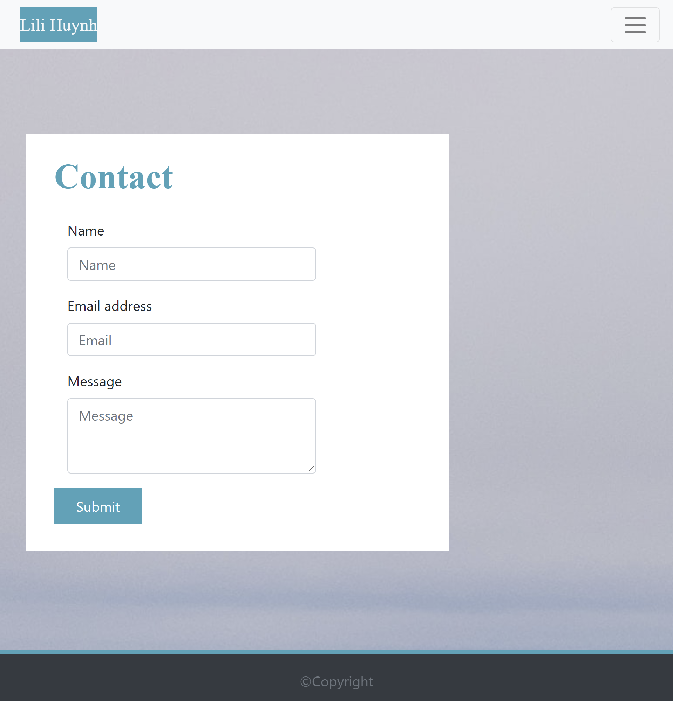
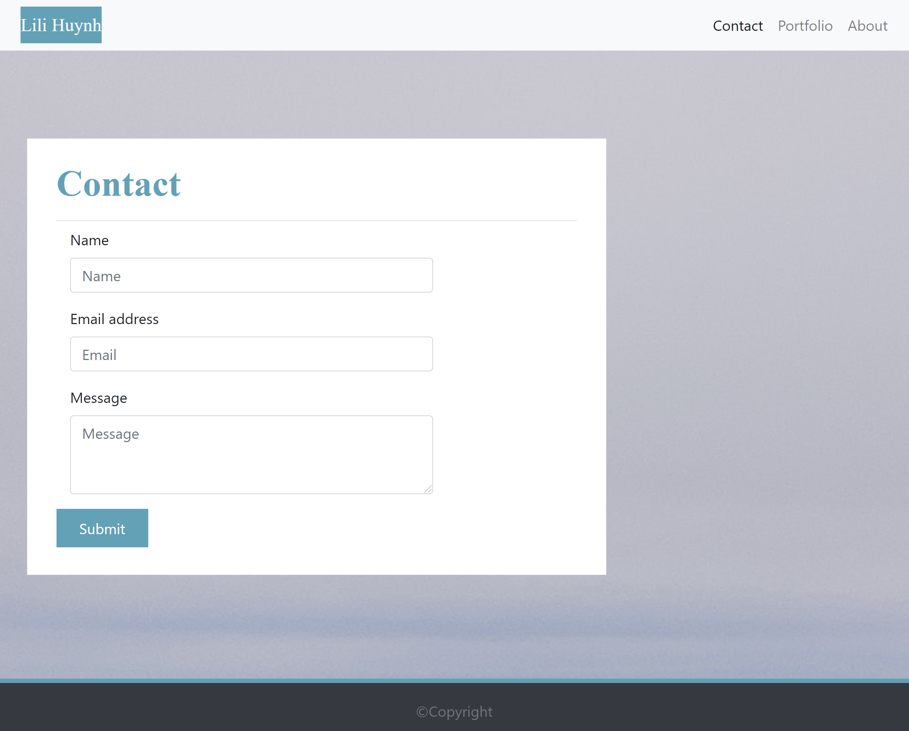
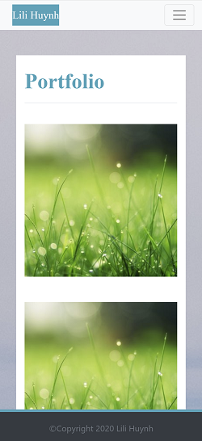
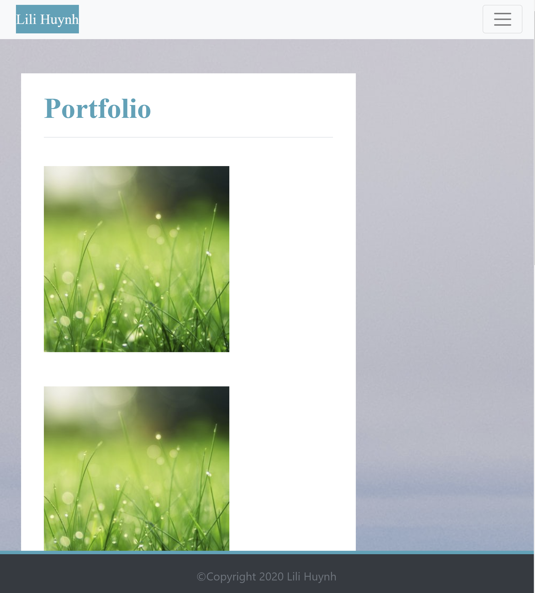
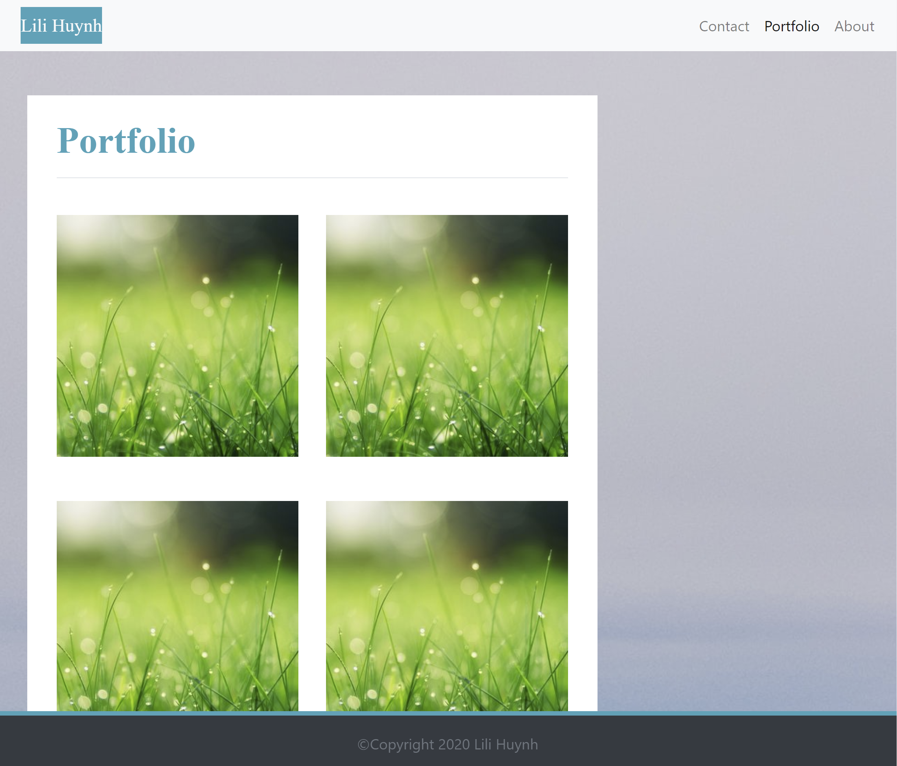

# MY-PORTFOLIO-TEMPLATE

Project link: [https://github.com/lillianhuynh/My-Portfolio-template]

Github-page: [https://lillianhuynh.github.io/My-Portfolio-template/]

## Table of Contents

* [About the Project](#about-the-project)
  * [Built With](#built-with)
* [Getting Started](#getting-started)
  * [Installation](#installation)
* [Usage](#usage)
* [Roadmap](#roadmap)
* [Contributing](#contributing)
* [License](#license)
* [Contact](#contact)

## About The Project


"My Portfolio" template is built based on responsive web design approach which helps the applications work seemlessly regardless of user's devices or screen sizes. With "My Portfolio", you can easily track and update your contact information and projects. It is an excellent way to present your work to your potential employers. 

### Built With

* Bootstrap (CSS)

## Getting Started

To get a local copy up and running follow these simple steps.

### Installation

1. Clone the repo
```sh
git clone https://github.com/lillianhuynh/My-Portfolio-template
```

## Usage

You can easily track and update your contact information and projects by using this template.

| 400px        | 768px        | 992px        |
|------------|------------|------------|
|  |  | |

| 400px        | 768px        | 992px        |
|------------|------------|------------|
|  |  | |

| 400px        | 768px        | 992px        |
|------------|------------|------------|
|  |  | |

## Roadmap

See the [open issues](https://github.com/lillianhuynh/My-Portfolio-template/issues) for a list of proposed features (and known issues).

## Contributing

Contributions are what make the open source community such an amazing place to be learn, inspire, and create. Any contributions you make are **greatly appreciated**.

1. Fork the Project
2. Create your Feature Branch (`git checkout -b feature/AmazingFeature`)
3. Commit your Changes (`git commit -m 'Add some AmazingFeature'`)
4. Push to the Branch (`git push origin feature/AmazingFeature`)
5. Open a Pull Request

## License

N/A

## Contact

Lili Huynh- lillianhuynh312@gmail.com
Project link: [https://github.com/lillianhuynh/My-Portfolio-template]